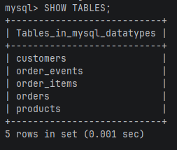
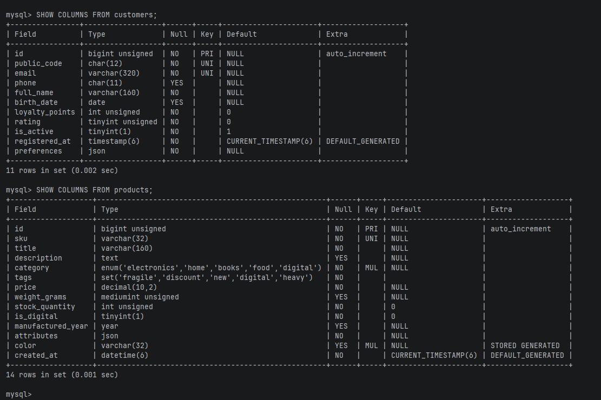
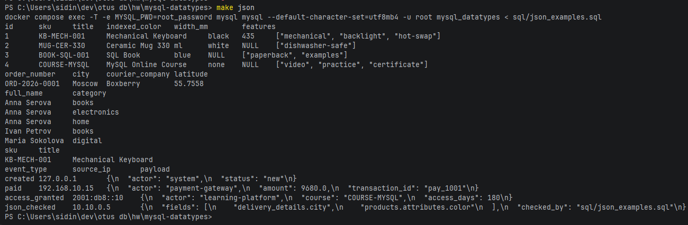

# mysql-datatypes

Домашнее задание по типам данных в MySQL. В проекте реализована небольшая база интернет-магазина: покупатели, товары, заказы, позиции заказа и журнал событий. Схема простая, зато на ней удобно потрогать почти все типы, которые обычно встречаются в прикладной базе.

Главный акцент здесь на идентификаторах. В MySQL с InnoDB первичный ключ не просто проверяет уникальность: строки таблицы лежат в листьях кластеризованного индекса. Поэтому тип и порядок значений `PRIMARY KEY` напрямую влияют на то, как база пишет и читает данные с диска.

## Что внутри

В проекте есть готовая схема MySQL, тестовые записи и набор SQL-примеров для проверки JSON. База поднимается в Docker, а частые команды вынесены в `Makefile`, чтобы не держать длинные команды в голове.

Схема сразу спроектирована с осознанным выбором типов: что должно быть компактным - компактное, что требует точности - не хранится во `FLOAT`, а гибкие свойства вынесены в `JSON`. Ничего лишнего, но все ключевые решения видны в коде и в объяснениях ниже.

## Быстрый запуск

Запустить MySQL:

```bash
make up
```

Применить схему и тестовые записи:

```bash
make init
```

Выполнить примеры по JSON:

```bash
make json
```

Открыть консоль MySQL:

```bash
make mysql
```

Остановить контейнер:

```bash
make down
```

Удалить контейнеры вместе с volume:

```bash
make clean
```

`make clean` удаляет данные MySQL. Для учебного стенда это нормально, но команда всё равно резкая. Лучше запускать её только когда база точно не нужна.

## Структура

```text
.
|-- compose.yaml
|-- docker/
|   `-- mysql/
|       `-- init/
|           |-- 01_schema.sql
|           `-- 02_seed.sql
|-- sql/
|   `-- json_examples.sql
|-- snapshots/
|-- .env.example
|-- .gitignore
|-- Makefile
`-- README.md
```

Файлы из `docker/mysql/init` MySQL выполняет автоматически только при первом создании volume. Если контейнер уже запускался раньше, проще выполнить `make init`: команда пересоздаст учебные таблицы и заново положит тестовые записи.

## Модель

В базе пять таблиц:

- `customers` - покупатели и их настройки;
- `products` - товары и переменные характеристики товара;
- `orders` - заказы, доставка и статусы;
- `order_items` - строки заказа;
- `order_events` - журнал событий по заказу.

Почему интернет-магазин? Он достаточно живой: есть деньги, даты, статусы, количество товара, доставка, комментарии, IP-адреса и свойства, которые удобно хранить в JSON. При этом схема не раздута ради схемы.

## ID и кластеризованный индекс

Для всех первичных ключей выбран `BIGINT UNSIGNED AUTO_INCREMENT`:

- `customers.id`;
- `products.id`;
- `orders.id`;
- `order_items.id`;
- `order_events.id`.

Причина практичная. InnoDB хранит таблицу как кластеризованный индекс по `PRIMARY KEY`, а значит рядом с ключом физически лежат все данные строки. Если сделать первичным ключом случайный UUID или другой хаотичный идентификатор, новые строки будут попадать не в конец индекса, а в разные уже заполненные страницы. Что получится? Больше page split, хуже локальность записи, больше лишнего движения страниц на диске.

`BIGINT UNSIGNED AUTO_INCREMENT` растёт последовательно. Вставки идут предсказуемо, ключ занимает 8 байт и даёт большой запас значений. Для учебного проекта хватил бы и `INT UNSIGNED`, но в реальных заказах и событиях счётчик может расти годами. Запас здесь дешевле, чем будущая миграция первичных ключей.

Внутри каждой таблицы первичный ключ называется просто `id`. А вот внешние ключи названы по таблице, на которую они указывают: `customer_id`, `order_id`, `product_id`. Читать такую схему легче: `orders.id` - сам заказ, `orders.customer_id` - покупатель заказа.

Публичные коды вынесены отдельно:

- `customers.public_code CHAR(12)`;
- `orders.order_number CHAR(14)`;
- `products.sku VARCHAR(32)`.

Они уникальны, их можно показывать пользователю, печатать в письмах и логах. Но они не становятся кластеризованным ключом. Это важная граница.

## Выбор типов данных

| Тип | Где используется | Почему выбран |
| --- | --- | --- |
| `BIGINT UNSIGNED` | первичные ключи `id` и внешние ключи `customer_id`, `order_id`, `product_id` | Последовательный числовой ключ хорошо ложится на кластеризованный индекс InnoDB и даёт большой запас значений. |
| `CHAR(12)`, `CHAR(14)` | `public_code`, `order_number` | Фиксированная длина удобна для кодов вроде `CUST00000001` и `ORD-2026-0001`. |
| `VARCHAR(32..500)` | email, SKU, имя, комментарий | Строки разной длины. Ограничение сверху защищает от бесконтрольного роста поля. |
| `TEXT` | описание товара | Описание может быть длиннее обычного названия, но по нему не строится основной поиск. |
| `TINYINT UNSIGNED` | рейтинг покупателя | Рейтинг от 0 до 5 не требует `INT`. Маленький тип честнее показывает диапазон. |
| `SMALLINT UNSIGNED` | количество товара в строке заказа | В одной позиции не нужны миллионы штук, зато тип компактный. |
| `MEDIUMINT UNSIGNED` | вес товара в граммах | Вес физического товара может быть больше 65 535 грамм, но `INT` тут уже слегка избыточен. |
| `INT UNSIGNED` | остатки и бонусные баллы | Значения могут расти, но 4 байт достаточно с большим запасом. |
| `DECIMAL(10,2)`, `DECIMAL(12,2)` | цены, суммы, скидки | Деньги нельзя хранить в `FLOAT`: бинарная дробь даст ошибки округления. |
| `BOOLEAN` | активность покупателя, цифровой товар | В MySQL это синоним `TINYINT(1)`, зато смысл поля читается сразу. |
| `DATE` | дата рождения, дата доставки | Нужна дата без времени. Тут не надо тащить часы и минуты. |
| `TIME` | окно доставки | Время доставки отдельно от даты: `10:00:00` - `14:00:00`. |
| `DATETIME(6)` | создание заказа, товара | Хранит дату и время с микросекундами без привязки к часовому поясу. |
| `TIMESTAMP(6)` | оплата, события | Удобен для технических событий: MySQL хранит значение с учётом часового пояса сессии. |
| `YEAR` | год выпуска товара | Для года отдельный тип читается лучше, чем `SMALLINT`. |
| `ENUM` | статусы и категории | Набор значений заранее известен: статус заказа, статус оплаты, категория товара. |
| `SET` | теги товара | Товар может иметь несколько простых флагов: `fragile`, `discount`, `digital`. Да, тип специфичный для MySQL, но здесь он наглядный. |
| `VARBINARY(16)` | IP-адрес в `order_events.source_ip` | IPv4 и IPv6 хранятся компактно через `INET6_ATON()` и читаются через `INET6_NTOA()`. |
| `JSON` | настройки, характеристики, доставка, payload событий | Подходит для гибких полей, где структура зависит от сценария. |

Отдельно добавлена вычисляемая колонка `products.color`. Она берёт цвет из `products.attributes` и хранит его как обычный `VARCHAR(32)`. Зачем? Если поле из JSON часто участвует в фильтрах, его лучше вынести в generated column и индексировать. В схеме есть индекс `ix_products_color`.

## Где здесь JSON

JSON используется там, где структура может отличаться от записи к записи:

- `customers.preferences` - подписка, любимые категории, лимиты покупателя;
- `products.attributes` - цвет, габариты, материал, длительность доступа, список особенностей;
- `orders.delivery_details` - адрес, координаты, курьерская служба или цифровая доставка;
- `order_events.payload` - технические детали события.

Не всё подряд стоит класть в JSON. Цена, статус, дата доставки, внешний ключ на покупателя и количество товара лежат в обычных колонках. По ним удобно фильтровать, считать и строить связи. JSON оставлен для «хвоста» свойств, который меняется чаще самой схемы.

Пример добавления JSON:

```sql
INSERT INTO order_events (order_id, event_type, source_ip, payload)
SELECT
    o.id,
    'json_checked',
    INET6_ATON('10.10.0.5'),
    JSON_OBJECT(
        'checked_by', 'sql/json_examples.sql',
        'fields', JSON_ARRAY('delivery_details.city', 'products.attributes.color')
    )
FROM orders AS o
WHERE o.order_number = 'ORD-2026-0001';
```

Пример выборки поля из JSON:

```sql
SELECT
    order_number,
    delivery_details->>'$.city' AS city,
    delivery_details->>'$.courier.company' AS courier_company
FROM orders
WHERE delivery_details->>'$.city' = 'Moscow';
```

Пример разворачивания JSON-массива в строки:

```sql
SELECT
    c.full_name,
    preferred.category
FROM customers AS c
JOIN JSON_TABLE(
    c.preferences,
    '$.favorite_categories[*]'
    COLUMNS (
        category VARCHAR(40) PATH '$'
    )
) AS preferred;
```

Пример поиска значения внутри JSON-массива:

```sql
SELECT
    sku,
    title
FROM products
WHERE JSON_CONTAINS(JSON_EXTRACT(attributes, '$.features'), JSON_QUOTE('mechanical'));
```

Полная подборка запросов лежит в `sql/json_examples.sql`.

## Проверка

После запуска `make init` можно проверить таблицы:

```sql
SHOW TABLES;
SELECT * FROM customers;
SELECT * FROM products;
SELECT * FROM orders;
```

Проверить типы колонок:

```sql
SHOW COLUMNS FROM products;
SHOW COLUMNS FROM order_events;
```

Проверить вычисляемую колонку из JSON:

```sql
SELECT sku, title, color
FROM products
ORDER BY id;
```

Проверить IP-адреса из `VARBINARY(16)`:

```sql
SELECT event_type, INET6_NTOA(source_ip) AS source_ip
FROM order_events;
```

## Скриншоты проверки

В `snapshots` лежат три скриншота с проверкой базы:

- `snapshots/01-tables.png` - список таблиц после `SHOW TABLES;`;
- `snapshots/02-columns.png` - типы колонок, например `SHOW COLUMNS FROM customers;` и `SHOW COLUMNS FROM products;`;
- `snapshots/03-json-query.png` - вывод `make json`: JSON-поля, `JSON_TABLE`, поиск по JSON-массиву и IP-адреса.






