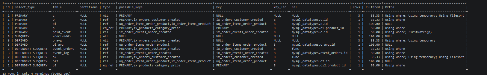
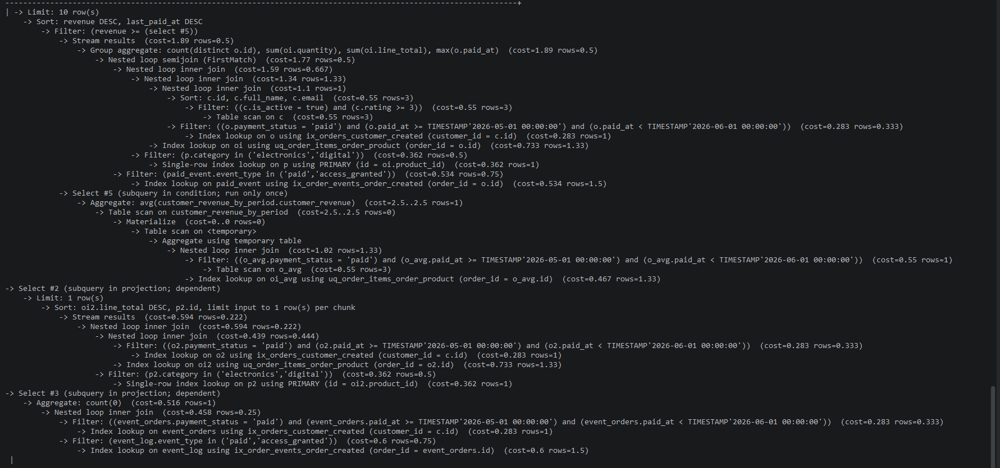
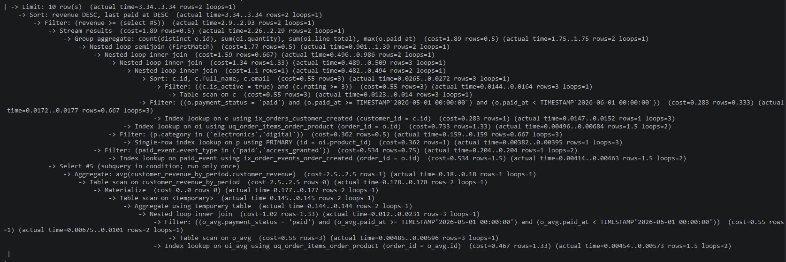
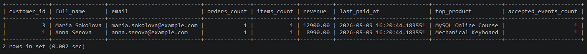
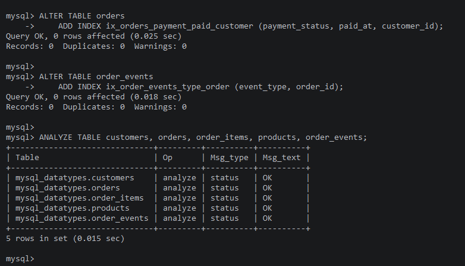
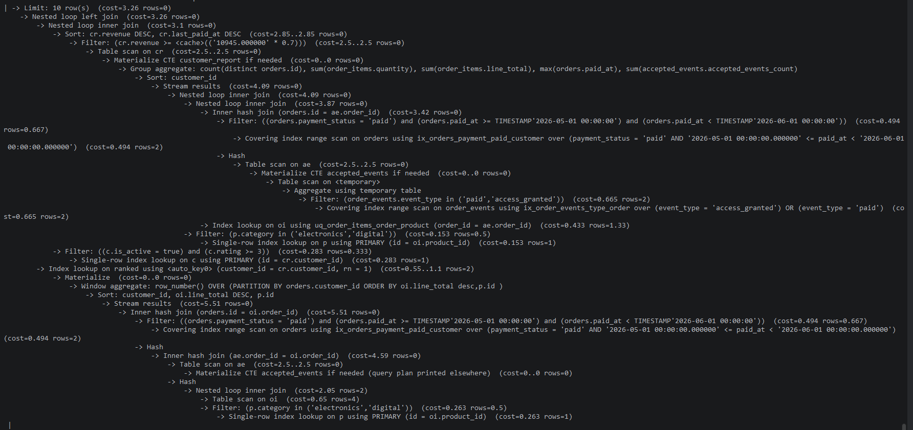
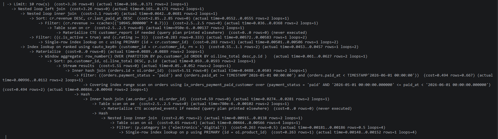
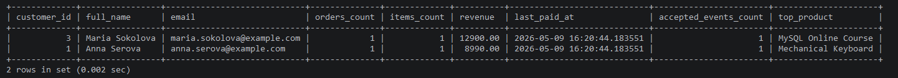

# Анализ и профилирование запроса

## Задача

Для анализа взят отчет по оплаченной выручке клиентов за период. Такой запрос нужен менеджеру магазина: быстро увидеть активных покупателей, сумму покупок, количество товаров, последний платеж и самый дорогой товар в заказах.

Запрос не использует JSON. В нем есть несколько `JOIN`, фильтры, агрегаты, `EXISTS`, скалярные подзапросы и подзапрос в `HAVING`. На маленькой базе он выглядит безобидно, но при росте заказов начнет терять время на повторных проходах по таблицам. Хороший кандидат для профилирования, разве нет?

## Подготовка

```bash
make init
make mysql
```

```sql
USE mysql_datatypes;
```

## Исходный запрос

Ниже запрос, который анализируется в блоке `EXPLAIN до оптимизации`. Для скриншотов нужно выполнять его с разными префиксами: `EXPLAIN FORMAT=TRADITIONAL`, `EXPLAIN FORMAT=JSON`, `EXPLAIN FORMAT=TREE` и `EXPLAIN ANALYZE`.

Примечательно, что обычный `EXPLAIN` без явного `FORMAT` может зависеть от настройки `@@explain_format`. Если там стоит `TREE`, то простой `EXPLAIN SELECT ...` тоже покажет дерево. Поэтому табличный план лучше фиксировать явно: `EXPLAIN FORMAT=TRADITIONAL`.

```sql
SELECT
    c.id AS customer_id,
    c.full_name,
    c.email,
    COUNT(DISTINCT o.id) AS orders_count,
    SUM(oi.quantity) AS items_count,
    SUM(oi.line_total) AS revenue,
    MAX(o.paid_at) AS last_paid_at,
    (
        SELECT p2.title
        FROM orders AS o2
        JOIN order_items AS oi2
            ON oi2.order_id = o2.id
        JOIN products AS p2
            ON p2.id = oi2.product_id
        WHERE o2.customer_id = c.id
          AND o2.payment_status = 'paid'
          AND o2.paid_at >= '2026-05-01 00:00:00'
          AND o2.paid_at < '2026-06-01 00:00:00'
          AND p2.category IN ('electronics', 'digital')
        ORDER BY oi2.line_total DESC, p2.id
        LIMIT 1
    ) AS top_product,
    (
        SELECT COUNT(*)
        FROM orders AS event_orders
        JOIN order_events AS event_log
            ON event_log.order_id = event_orders.id
        WHERE event_orders.customer_id = c.id
          AND event_orders.payment_status = 'paid'
          AND event_orders.paid_at >= '2026-05-01 00:00:00'
          AND event_orders.paid_at < '2026-06-01 00:00:00'
          AND event_log.event_type IN ('paid', 'access_granted')
    ) AS accepted_events_count
FROM customers AS c
JOIN orders AS o
    ON o.customer_id = c.id
JOIN order_items AS oi
    ON oi.order_id = o.id
JOIN products AS p
    ON p.id = oi.product_id
WHERE c.is_active = TRUE
  AND c.rating >= 3
  AND o.payment_status = 'paid'
  AND o.paid_at >= '2026-05-01 00:00:00'
  AND o.paid_at < '2026-06-01 00:00:00'
  AND p.category IN ('electronics', 'digital')
  AND EXISTS (
      SELECT 1
      FROM order_events AS paid_event
      WHERE paid_event.order_id = o.id
        AND paid_event.event_type IN ('paid', 'access_granted')
  )
GROUP BY c.id, c.full_name, c.email
HAVING revenue >= (
    SELECT AVG(customer_revenue) * 0.7
    FROM (
        SELECT
            o_avg.customer_id,
            SUM(oi_avg.line_total) AS customer_revenue
        FROM orders AS o_avg
        JOIN order_items AS oi_avg
            ON oi_avg.order_id = o_avg.id
        WHERE o_avg.payment_status = 'paid'
          AND o_avg.paid_at >= '2026-05-01 00:00:00'
          AND o_avg.paid_at < '2026-06-01 00:00:00'
        GROUP BY o_avg.customer_id
    ) AS customer_revenue_by_period
)
ORDER BY revenue DESC, last_paid_at DESC
LIMIT 10;
```

## EXPLAIN до оптимизации

### 1. Табличный формат

Выполняется исходный запрос с префиксом:

```sql
EXPLAIN FORMAT=TRADITIONAL
```



### 2. JSON-формат

Выполняется исходный запрос с префиксом:

```sql
EXPLAIN FORMAT=JSON
```

JSON получается слишком большим для скриншота, поэтому он вынесен в раскрывающийся блок.

<details>
<summary>EXPLAIN FORMAT=JSON</summary>

```json
{
  "query": "/* select#1 */ select `c`.`id` AS `customer_id`,`c`.`full_name` AS `full_name`,`c`.`email` AS `email`,count(distinct `o`.`id`) AS `orders_count`,sum(`oi`.`quantity`) AS `items_count`,sum(`oi`.`line_total`) AS `revenue`,max(`o`.`paid_at`) AS `last_paid_at`,(/* select#2 */ select `p2`.`title` from `mysql_datatypes`.`orders` `o2` join `mysql_datatypes`.`order_items` `oi2` join `mysql_datatypes`.`products` `p2` where ((`oi2`.`order_id` = `o2`.`id`) and (`p2`.`id` = `oi2`.`product_id`) and (`o2`.`payment_status` = 'paid') and (`o2`.`customer_id` = `c`.`id`) and (`o2`.`paid_at` >= TIMESTAMP'2026-05-01 00:00:00') and (`o2`.`paid_at` < TIMESTAMP'2026-06-01 00:00:00') and (`p2`.`category` in ('electronics','digital'))) order by `oi2`.`line_total` desc,`p2`.`id` limit 1) AS `top_product`,(/* select#3 */ select count(0) from `mysql_datatypes`.`orders` `event_orders` join `mysql_datatypes`.`order_events` `event_log` where ((`event_log`.`order_id` = `event_orders`.`id`) and (`event_orders`.`payment_status` = 'paid') and (`event_orders`.`customer_id` = `c`.`id`) and (`event_orders`.`paid_at` >= TIMESTAMP'2026-05-01 00:00:00') and (`event_orders`.`paid_at` < TIMESTAMP'2026-06-01 00:00:00') and (`event_log`.`event_type` in ('paid','access_granted')))) AS `accepted_events_count` from `mysql_datatypes`.`customers` `c` join `mysql_datatypes`.`orders` `o` join `mysql_datatypes`.`order_items` `oi` join `mysql_datatypes`.`products` `p` semi join (`mysql_datatypes`.`order_events` `paid_event`) where ((`o`.`customer_id` = `c`.`id`) and (`p`.`id` = `oi`.`product_id`) and (`oi`.`order_id` = `o`.`id`) and (`paid_event`.`order_id` = `o`.`id`) and (`o`.`payment_status` = 'paid') and (`c`.`is_active` = true) and (`c`.`rating` >= 3) and (`o`.`paid_at` >= TIMESTAMP'2026-05-01 00:00:00') and (`o`.`paid_at` < TIMESTAMP'2026-06-01 00:00:00') and (`p`.`category` in ('electronics','digital')) and (`paid_event`.`event_type` in ('paid','access_granted'))) group by `c`.`id`,`c`.`full_name`,`c`.`email` having (`revenue` >= (/* select#5 */ select (avg(`customer_revenue_by_period`.`customer_revenue`) * 0.7) from (/* select#6 */ select `o_avg`.`customer_id` AS `customer_id`,sum(`oi_avg`.`line_total`) AS `customer_revenue` from `mysql_datatypes`.`orders` `o_avg` join `mysql_datatypes`.`order_items` `oi_avg` where ((`oi_avg`.`order_id` = `o_avg`.`id`) and (`o_avg`.`payment_status` = 'paid') and (`o_avg`.`paid_at` >= TIMESTAMP'2026-05-01 00:00:00') and (`o_avg`.`paid_at` < TIMESTAMP'2026-06-01 00:00:00')) group by `o_avg`.`customer_id`) `customer_revenue_by_period`)) order by `revenue` desc,`last_paid_at` desc limit 10",
  "query_plan": {
    "limit": 10,
    "inputs": [
      {
        "operation": "Sort: revenue DESC, last_paid_at DESC",
        "access_type": "sort",
        "sort_fields": [
          "revenue DESC",
          "last_paid_at DESC"
        ],
        "inputs": [
          {
            "operation": "Filter: (revenue >= (select #5))",
            "access_type": "filter",
            "filter_columns": [
              "oi.line_total"
            ],
            "inputs": [
              {
                "operation": "Stream results",
                "access_type": "stream",
                "estimated_rows": 0.5000000298023228,
                "estimated_total_cost": 1.8874296589854203,
                "inputs": [
                  {
                    "operation": "Group aggregate: count(distinct o.id), sum(oi.quantity), sum(oi.line_total), max(o.paid_at)",
                    "access_type": "aggregate",
                    "group_by": true,
                    "functions": [
                      "count(distinct o.id)",
                      "sum(oi.quantity)",
                      "sum(oi.line_total)",
                      "max(o.paid_at)"
                    ],
                    "estimated_rows": 0.5000000298023228,
                    "estimated_total_cost": 1.8874296589854203,
                    "inputs": [
                      {
                        "operation": "Nested loop semijoin (FirstMatch)",
                        "access_type": "join",
                        "join_type": "semijoin",
                        "join_algorithm": "nested_loop",
                        "semijoin_strategy": "firstmatch",
                        "estimated_rows": 0.5000000298023228,
                        "estimated_total_cost": 1.7722222788466362,
                        "inputs": [
                          {
                            "operation": "Nested loop inner join",
                            "access_type": "join",
                            "join_type": "inner join",
                            "join_algorithm": "nested_loop",
                            "estimated_rows": 0.6666667064030971,
                            "estimated_total_cost": 1.5888889321022575,
                            "inputs": [
                              {
                                "operation": "Nested loop inner join",
                                "access_type": "join",
                                "join_type": "inner join",
                                "join_algorithm": "nested_loop",
                                "estimated_rows": 1.3333334128061942,
                                "estimated_total_cost": 1.344444469776419,
                                "inputs": [
                                  {
                                    "operation": "Nested loop inner join",
                                    "access_type": "join",
                                    "join_type": "inner join",
                                    "join_algorithm": "nested_loop",
                                    "estimated_rows": 1.0000000298023224,
                                    "estimated_total_cost": 1.1000000074505807,
                                    "inputs": [
                                      {
                                        "operation": "Sort: c.id, c.full_name, c.email",
                                        "access_type": "sort",
                                        "sort_fields": [
                                          "c.id",
                                          "c.full_name",
                                          "c.email"
                                        ],
                                        "estimated_rows": 3.0,
                                        "estimated_total_cost": 0.55,
                                        "inputs": [
                                          {
                                            "operation": "Filter: ((c.is_active = true) and (c.rating >= 3))",
                                            "access_type": "filter",
                                            "condition": "((c.is_active = true) and (c.rating >= 3))",
                                            "estimated_rows": 3.0,
                                            "estimated_total_cost": 0.55,
                                            "filter_columns": [
                                              "c.is_active",
                                              "c.rating"
                                            ],
                                            "inputs": [
                                              {
                                                "operation": "Table scan on c",
                                                "access_type": "table",
                                                "schema_name": "mysql_datatypes",
                                                "table_name": "customers",
                                                "alias": "c",
                                                "estimated_rows": 3.0,
                                                "estimated_total_cost": 0.55,
                                                "used_columns": [
                                                  "id",
                                                  "email",
                                                  "full_name",
                                                  "rating",
                                                  "is_active"
                                                ]
                                              }
                                            ]
                                          }
                                        ]
                                      },
                                      {
                                        "operation": "Filter: ((o.payment_status = 'paid') and (o.paid_at >= TIMESTAMP'2026-05-01 00:00:00') and (o.paid_at < TIMESTAMP'2026-06-01 00:00:00'))",
                                        "access_type": "filter",
                                        "condition": "((o.payment_status = 'paid') and (o.paid_at >= TIMESTAMP'2026-05-01 00:00:00') and (o.paid_at < TIMESTAMP'2026-06-01 00:00:00'))",
                                        "estimated_rows": 0.3333333432674408,
                                        "estimated_total_cost": 0.2833333333333333,
                                        "filter_columns": [
                                          "o.paid_at",
                                          "o.payment_status"
                                        ],
                                        "inputs": [
                                          {
                                            "operation": "Index lookup on o using ix_orders_customer_created (customer_id = c.id)",
                                            "access_type": "index",
                                            "index_access_type": "index_lookup",
                                            "schema_name": "mysql_datatypes",
                                            "table_name": "orders",
                                            "alias": "o",
                                            "index_name": "ix_orders_customer_created",
                                            "lookup_condition": "customer_id = c.id",
                                            "key_columns": [
                                              "customer_id"
                                            ],
                                            "lookup_references": [
                                              "mysql_datatypes.c.id"
                                            ],
                                            "used_columns": [
                                              "id",
                                              "customer_id",
                                              "payment_status",
                                              "paid_at"
                                            ],
                                            "estimated_rows": 1.0,
                                            "estimated_total_cost": 0.2833333333333333
                                          }
                                        ]
                                      }
                                    ]
                                  },
                                  {
                                    "operation": "Index lookup on oi using uq_order_items_order_product (order_id = o.id)",
                                    "access_type": "index",
                                    "index_access_type": "index_lookup",
                                    "schema_name": "mysql_datatypes",
                                    "table_name": "order_items",
                                    "alias": "oi",
                                    "index_name": "uq_order_items_order_product",
                                    "lookup_condition": "order_id = o.id",
                                    "key_columns": [
                                      "order_id"
                                    ],
                                    "lookup_references": [
                                      "mysql_datatypes.o.id"
                                    ],
                                    "used_columns": [
                                      "id",
                                      "order_id",
                                      "product_id",
                                      "quantity",
                                      "line_total"
                                    ],
                                    "estimated_rows": 1.3333333730697632,
                                    "estimated_total_cost": 0.7333333313465122
                                  }
                                ]
                              },
                              {
                                "operation": "Filter: (p.category in ('electronics','digital'))",
                                "access_type": "filter",
                                "condition": "(p.category in ('electronics','digital'))",
                                "estimated_rows": 0.5,
                                "estimated_total_cost": 0.3624999899417168,
                                "filter_columns": [
                                  "p.category"
                                ],
                                "inputs": [
                                  {
                                    "operation": "Single-row index lookup on p using PRIMARY (id = oi.product_id)",
                                    "access_type": "index",
                                    "index_access_type": "index_lookup",
                                    "schema_name": "mysql_datatypes",
                                    "table_name": "products",
                                    "alias": "p",
                                    "index_name": "PRIMARY",
                                    "lookup_condition": "id = oi.product_id",
                                    "key_columns": [
                                      "id"
                                    ],
                                    "lookup_references": [
                                      "mysql_datatypes.oi.product_id"
                                    ],
                                    "used_columns": [
                                      "id",
                                      "category"
                                    ],
                                    "estimated_rows": 1.0,
                                    "estimated_total_cost": 0.3624999899417168
                                  }
                                ]
                              }
                            ]
                          },
                          {
                            "operation": "Filter: (paid_event.event_type in ('paid','access_granted'))",
                            "access_type": "filter",
                            "condition": "(paid_event.event_type in ('paid','access_granted'))",
                            "estimated_rows": 0.75,
                            "estimated_total_cost": 0.5343749773688627,
                            "filter_columns": [
                              "paid_event.event_type"
                            ],
                            "inputs": [
                              {
                                "operation": "Index lookup on paid_event using ix_order_events_order_created (order_id = o.id)",
                                "access_type": "index",
                                "index_access_type": "index_lookup",
                                "schema_name": "mysql_datatypes",
                                "table_name": "order_events",
                                "alias": "paid_event",
                                "index_name": "ix_order_events_order_created",
                                "lookup_condition": "order_id = o.id",
                                "key_columns": [
                                  "order_id"
                                ],
                                "lookup_references": [
                                  "mysql_datatypes.o.id"
                                ],
                                "used_columns": [
                                  "id",
                                  "order_id",
                                  "event_type"
                                ],
                                "estimated_rows": 1.5,
                                "estimated_total_cost": 0.5343749773688627
                              }
                            ]
                          }
                        ]
                      }
                    ]
                  }
                ]
              },
              {
                "heading": "Select #5 (subquery in condition; run only once)",
                "subquery": true,
                "cacheable": true,
                "operation": "Aggregate: avg(customer_revenue_by_period.customer_revenue)",
                "access_type": "aggregate",
                "subquery_location": "condition",
                "functions": [
                  "avg(customer_revenue_by_period.customer_revenue)"
                ],
                "estimated_rows": 1.0,
                "estimated_total_cost": 2.5,
                "estimated_first_row_cost": 2.5,
                "inputs": [
                  {
                    "operation": "Table scan on customer_revenue_by_period",
                    "access_type": "table",
                    "table_name": "customer_revenue_by_period",
                    "estimated_rows": 0.0,
                    "estimated_total_cost": 2.5,
                    "estimated_first_row_cost": 2.5,
                    "used_columns": [
                      "customer_id",
                      "customer_revenue"
                    ],
                    "inputs": [
                      {
                        "operation": "Materialize",
                        "access_type": "materialize",
                        "estimated_rows": 0.0,
                        "estimated_total_cost": 0.0,
                        "estimated_first_row_cost": 0.0,
                        "inputs": [
                          {
                            "operation": "Table scan on <temporary>",
                            "access_type": "table",
                            "table_name": "<temporary>",
                            "inputs": [
                              {
                                "operation": "Aggregate using temporary table",
                                "access_type": "temp_table_aggregate",
                                "inputs": [
                                  {
                                    "operation": "Nested loop inner join",
                                    "access_type": "join",
                                    "join_type": "inner join",
                                    "join_algorithm": "nested_loop",
                                    "estimated_rows": 1.3333334128061942,
                                    "estimated_total_cost": 1.016666694482168,
                                    "inputs": [
                                      {
                                        "operation": "Filter: ((o_avg.payment_status = 'paid') and (o_avg.paid_at >= TIMESTAMP'2026-05-01 00:00:00') and (o_avg.paid_at < TIMESTAMP'2026-06-01 00:00:00'))",
                                        "access_type": "filter",
                                        "condition": "((o_avg.payment_status = 'paid') and (o_avg.paid_at >= TIMESTAMP'2026-05-01 00:00:00') and (o_avg.paid_at < TIMESTAMP'2026-06-01 00:00:00'))",
                                        "estimated_rows": 1.0000000298023224,
                                        "estimated_total_cost": 0.55,
                                        "filter_columns": [
                                          "o_avg.paid_at",
                                          "o_avg.payment_status"
                                        ],
                                        "inputs": [
                                          {
                                            "operation": "Table scan on o_avg",
                                            "access_type": "table",
                                            "schema_name": "mysql_datatypes",
                                            "table_name": "orders",
                                            "alias": "o_avg",
                                            "estimated_rows": 3.0,
                                            "estimated_total_cost": 0.55,
                                            "used_columns": [
                                              "id",
                                              "customer_id",
                                              "payment_status",
                                              "paid_at"
                                            ]
                                          }
                                        ]
                                      },
                                      {
                                        "operation": "Index lookup on oi_avg using uq_order_items_order_product (order_id = o_avg.id)",
                                        "access_type": "index",
                                        "index_access_type": "index_lookup",
                                        "schema_name": "mysql_datatypes",
                                        "table_name": "order_items",
                                        "alias": "oi_avg",
                                        "index_name": "uq_order_items_order_product",
                                        "lookup_condition": "order_id = o_avg.id",
                                        "key_columns": [
                                          "order_id"
                                        ],
                                        "lookup_references": [
                                          "mysql_datatypes.o_avg.id"
                                        ],
                                        "used_columns": [
                                          "id",
                                          "order_id",
                                          "line_total"
                                        ],
                                        "estimated_rows": 1.3333333730697632,
                                        "estimated_total_cost": 0.4666666766007741
                                      }
                                    ]
                                  }
                                ]
                              }
                            ]
                          }
                        ]
                      }
                    ]
                  }
                ]
              }
            ]
          }
        ]
      }
    ],
    "operation": "Limit: 10 row(s)",
    "access_type": "limit",
    "limit_offset": 0,
    "inputs_from_select_list": [
      {
        "heading": "Select #2 (subquery in projection; dependent)",
        "subquery": true,
        "dependent": true,
        "operation": "Limit: 1 row(s)",
        "access_type": "limit",
        "subquery_location": "projection",
        "limit": 1,
        "inputs": [
          {
            "operation": "Sort: oi2.line_total DESC, p2.id, limit input to 1 row(s) per chunk",
            "access_type": "sort",
            "sort_fields": [
              "oi2.line_total DESC",
              "p2.id"
            ],
            "per_chunk_limit": 1
          }
        ]
      },
      {
        "heading": "Select #3 (subquery in projection; dependent)",
        "subquery": true,
        "dependent": true,
        "operation": "Aggregate: count(0)",
        "access_type": "aggregate",
        "subquery_location": "projection",
        "functions": [
          "count(0)"
        ],
        "estimated_rows": 1.0,
        "estimated_total_cost": 0.5159370278948189
      }
    ]
  },
  "query_type": "select",
  "json_schema_version": "2.0"
}
```

</details>

### 3. TREE-формат

Выполняется исходный запрос с префиксом:

```sql
EXPLAIN FORMAT=TREE
```



### Фактическое выполнение

Выполняется исходный запрос с префиксом:

```sql
EXPLAIN ANALYZE
```



## Результат до оптимизации

Выполняется исходный запрос без `EXPLAIN`.



## Что видно в плане

По плану видно не одну большую проблему, а несколько повторных проходов. На учебных данных время маленькое, но структура запроса уже показывает, где он начнет проседать при росте таблиц:

- `Select #2 (subquery in projection; dependent)` отвечает за `top_product`. Он зависит от клиента, отдельно идет в `orders`, `order_items`, `products` и делает `Sort: oi2.line_total DESC, p2.id`;
- `Select #3 (subquery in projection; dependent)` отдельно считает `accepted_events_count`. Внутри снова читаются `orders` и `order_events`;
- `Select #5 (subquery in condition; run only once)` относится к условию в `HAVING`. Он материализует `customer_revenue_by_period` через временную таблицу и заново считает выручку по клиентам за тот же период;
- для `orders` используется индекс `ix_orders_customer_created`, после чего `payment_status` и `paid_at` проверяются фильтром. Под фильтр по оплате и периоду нужен отдельный составной индекс;
- для событий используется `ix_order_events_order_created` по `order_id`, а `event_type` проверяется уже после чтения строк. Поэтому для этого сценария полезен индекс, который начинается с `event_type` и содержит `order_id`.

## Оптимизация

Идея простая: один раз отобрать оплаченные заказы за период, один раз собрать подходящие события, затем переиспользовать эти наборы. Коррелированные подзапросы заменяются общими выборками через `WITH`. Плюс добавляются индексы под реальные условия фильтрации.

### Индексы и статистика

```sql
ALTER TABLE orders
    ADD INDEX ix_orders_payment_paid_customer (payment_status, paid_at, customer_id);

ALTER TABLE order_events
    ADD INDEX ix_order_events_type_order (event_type, order_id);

ANALYZE TABLE customers, orders, order_items, products, order_events;
```



Зачем именно такие индексы:

- `ix_orders_payment_paid_customer` помогает сразу найти оплаченные заказы за период и не перебирать лишние статусы;
- `ix_order_events_type_order` подходит для отбора событий `paid` и `access_granted`, после чего легко связать их с заказами;
- `ANALYZE TABLE` обновляет статистику оптимизатора после добавления индексов.

## Оптимизированный запрос

Ниже запрос после оптимизации. Для проверки плана после оптимизации достаточно `EXPLAIN FORMAT=TREE`: он показывает дерево операций и хорошо подсвечивает, где MySQL читает индексы, где материализует CTE, а где сортирует строки.

```sql
WITH period_orders AS (
    SELECT
        id,
        customer_id,
        paid_at
    FROM orders FORCE INDEX (ix_orders_payment_paid_customer)
    WHERE payment_status = 'paid'
      AND paid_at >= '2026-05-01 00:00:00'
      AND paid_at < '2026-06-01 00:00:00'
),
accepted_events AS (
    SELECT
        order_id,
        COUNT(*) AS accepted_events_count
    FROM order_events FORCE INDEX (ix_order_events_type_order)
    WHERE event_type IN ('paid', 'access_granted')
    GROUP BY order_id
),
customer_report AS (
    SELECT
        po.customer_id,
        COUNT(DISTINCT po.id) AS orders_count,
        SUM(oi.quantity) AS items_count,
        SUM(oi.line_total) AS revenue,
        MAX(po.paid_at) AS last_paid_at,
        SUM(ae.accepted_events_count) AS accepted_events_count
    FROM period_orders AS po
    JOIN accepted_events AS ae
        ON ae.order_id = po.id
    JOIN order_items AS oi
        ON oi.order_id = po.id
    JOIN products AS p
        ON p.id = oi.product_id
    WHERE p.category IN ('electronics', 'digital')
    GROUP BY po.customer_id
),
avg_revenue AS (
    SELECT AVG(revenue) AS value
    FROM customer_report
),
top_products AS (
    SELECT
        ranked.customer_id,
        ranked.title AS top_product
    FROM (
        SELECT
            po.customer_id,
            p.title,
            ROW_NUMBER() OVER (
                PARTITION BY po.customer_id
                ORDER BY oi.line_total DESC, p.id
            ) AS rn
        FROM period_orders AS po
        JOIN accepted_events AS ae
            ON ae.order_id = po.id
        JOIN order_items AS oi
            ON oi.order_id = po.id
        JOIN products AS p
            ON p.id = oi.product_id
        WHERE p.category IN ('electronics', 'digital')
    ) AS ranked
    WHERE ranked.rn = 1
)
SELECT
    c.id AS customer_id,
    c.full_name,
    c.email,
    cr.orders_count,
    cr.items_count,
    cr.revenue,
    cr.last_paid_at,
    tp.top_product,
    cr.accepted_events_count
FROM customer_report AS cr
JOIN customers AS c
    ON c.id = cr.customer_id
CROSS JOIN avg_revenue AS ar
LEFT JOIN top_products AS tp
    ON tp.customer_id = cr.customer_id
WHERE c.is_active = TRUE
  AND c.rating >= 3
  AND cr.revenue >= ar.value * 0.7
ORDER BY cr.revenue DESC, cr.last_paid_at DESC
LIMIT 10;
```

## EXPLAIN после оптимизации

Выполняется оптимизированный запрос с префиксом:

```sql
EXPLAIN FORMAT=TREE
```



### Фактическое выполнение после оптимизации

Выполняется оптимизированный запрос с префиксом:

```sql
EXPLAIN ANALYZE
```



## Результат после оптимизации

Выполняется оптимизированный запрос без `EXPLAIN`.



## Вывод

В исходном варианте запрос делает одну и ту же работу несколько раз: считает выручку в основном запросе, отдельно пересчитывает среднюю выручку в `HAVING`, отдельно ищет самый дорогой товар и отдельно считает события заказа. Это читается нормально, но масштабируется тяжело.

После оптимизации оплаченные заказы за период и подходящие события выделены в общие выборки. Индексы помогают быстрее отрезать ненужные заказы и события, а `ANALYZE TABLE` дает оптимизатору свежую статистику. Полностью сортировки не исчезают: они нужны для группировки клиентов, оконной функции `ROW_NUMBER()` и финального `ORDER BY`. Но теперь это сортировки поверх уже суженного набора строк. Результат запроса при этом не поменялся: меняется только способ получения данных.

По `EXPLAIN ANALYZE` на скриншотах тоже видно улучшение: до оптимизации верхний узел показывает `actual time=3.34..3.34`, после оптимизации — `actual time=0.166..0.171`. На таком маленьком наборе данных это не стоит воспринимать как точный бенчмарк, но направление верное: MySQL стал раньше отбирать оплаченные заказы по периоду через `ix_orders_payment_paid_customer` и события через `ix_order_events_type_order`.
