# Индексы

## Что изменено

В проект добавлены и пересмотрены индексы под четыре разных сценария:

| Индекс | Таблица | Тип | Сценарий |
| --- | --- | --- | --- |
| `uq_products_price` | `products` | `UNIQUE BTREE` | постраничная выдача товаров по цене без `OFFSET` |
| `ix_products_category_price` | `products` | составной `BTREE` | фильтр каталога по категории и диапазону цены |
| `ix_orders_status_created` | `orders` | составной `BTREE` | список заказов по статусу с сортировкой по дате |
| `ft_products_search` | `products` | `FULLTEXT` | поиск по названию, описанию и свойствам товара |

`ix_products_category` заменён на `ix_products_category_price`. Отдельный индекс по `category` тут избыточен: составной индекс начинается с `category`, поэтому MySQL может использовать его и для фильтра только по категории.

DDL:

```sql
ALTER TABLE products
    ADD COLUMN search_properties TEXT GENERATED ALWAYS AS
        (
            CONCAT_WS(
                ' ',
                JSON_UNQUOTE(JSON_EXTRACT(attributes, '$.color')),
                JSON_UNQUOTE(JSON_EXTRACT(attributes, '$.material')),
                JSON_UNQUOTE(JSON_EXTRACT(attributes, '$.features')),
                JSON_UNQUOTE(JSON_EXTRACT(attributes, '$.warranty_months')),
                JSON_UNQUOTE(JSON_EXTRACT(attributes, '$.duration_hours')),
                JSON_UNQUOTE(JSON_EXTRACT(attributes, '$.access_days'))
            )
        ) STORED,
    ADD UNIQUE KEY uq_products_price (price),
    ADD KEY ix_products_category_price (category, price),
    ADD FULLTEXT KEY ft_products_search (title, description, search_properties);

ALTER TABLE orders
    ADD KEY ix_orders_status_created (status, created_at);
```

## 1. Уникальный индекс по цене

**Зачем индекс**

Цены в `products.price` уникальные. Это позволяет делать постраничную выдачу по курсору: вместо `LIMIT 50 OFFSET 5000` можно передавать последнюю цену с предыдущей страницы и читать следующие 50 товаров.

`OFFSET` на дальних страницах дорогой: MySQL сначала проходит пропущенные строки, а потом отдаёт нужные. При курсорной выдаче он сразу идёт по индексу к следующей цене.

**Запрос без индекса**

```sql
EXPLAIN
SELECT
    id,
    sku,
    title,
    price
FROM products IGNORE INDEX (uq_products_price)
WHERE price > 2490.00
ORDER BY price
LIMIT 2;
```

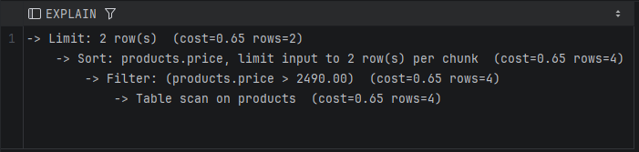

**Запрос с индексом**

```sql
EXPLAIN
SELECT
    id,
    sku,
    title,
    price
FROM products
WHERE price > 2490.00
ORDER BY price
LIMIT 2;
```

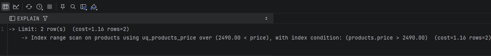

**Результат выборки**

```sql
SELECT
    id,
    sku,
    title,
    price
FROM products
WHERE price > 2490.00
ORDER BY price
LIMIT 2;
```

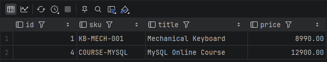

**Вывод**

Без индекса MySQL вынужден читать таблицу и отдельно сортировать результат по `price`. С индексом `uq_products_price` он использует range scan и сразу получает строки в нужном порядке. Для страниц по 50 товаров это лучше, чем `OFFSET`, особенно когда каталог вырастет.

## 2. Составной индекс по категории и цене

**Зачем индекс**

В каталоге часто выбирают категорию и диапазон цены. Для такого фильтра подходит составной индекс `(category, price)`: сначала MySQL отбирает категорию, затем внутри неё идёт по диапазону цен.

**Запрос без индекса**

```sql
EXPLAIN
SELECT
    id,
    sku,
    title,
    category,
    price
FROM products IGNORE INDEX (ix_products_category_price, uq_products_price)
WHERE category = 'electronics'
  AND price BETWEEN 1000.00 AND 10000.00
ORDER BY price;
```

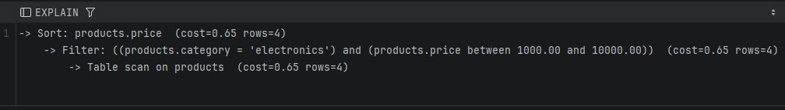

**Запрос с индексом**

```sql
EXPLAIN
SELECT
    id,
    sku,
    title,
    category,
    price
FROM products FORCE INDEX (ix_products_category_price)
WHERE category = 'electronics'
  AND price BETWEEN 1000.00 AND 10000.00
ORDER BY price;
```

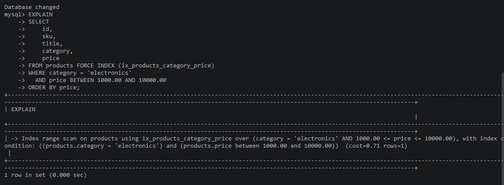

**Результат выборки**

```sql
SELECT
    id,
    sku,
    title,
    category,
    price
FROM products
WHERE category = 'electronics'
  AND price BETWEEN 1000.00 AND 10000.00
ORDER BY price;
```

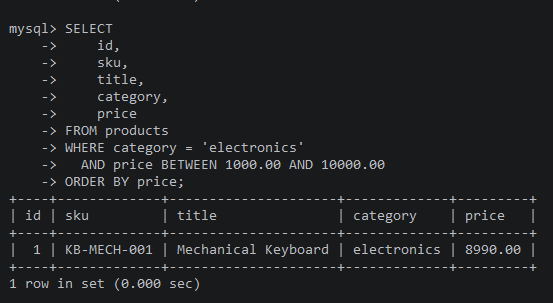

**Вывод**

Индекс `(category, price)` закрывает типовой фильтр каталога лучше, чем два отдельных индекса. MySQL может использовать левую часть индекса для категории и сразу продолжить поиск по диапазону цены.

## 3. Составной индекс по статусу заказа и дате

**Зачем индекс**

В админке заказы часто смотрят по статусу: новые, оплаченные, завершённые. Почти всегда нужен свежий список, поэтому к статусу добавлена дата создания.

**Запрос без индекса**

```sql
EXPLAIN
SELECT
    id,
    order_number,
    status,
    created_at
FROM orders IGNORE INDEX (ix_orders_status_created)
WHERE status = 'paid'
ORDER BY created_at DESC
LIMIT 10;
```

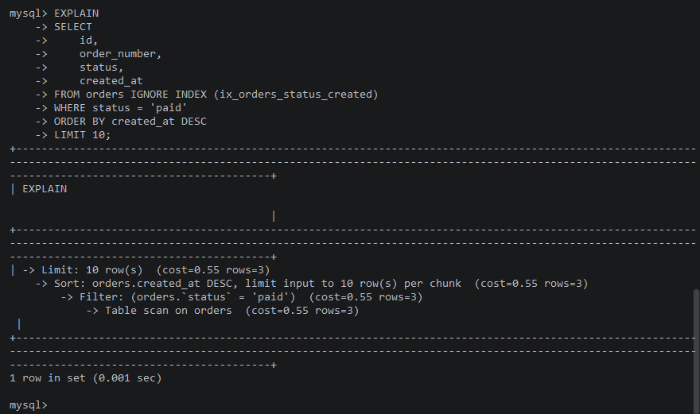

**Запрос с индексом**

```sql
EXPLAIN
SELECT
    id,
    order_number,
    status,
    created_at
FROM orders FORCE INDEX (ix_orders_status_created)
WHERE status = 'paid'
ORDER BY created_at DESC
LIMIT 10;
```

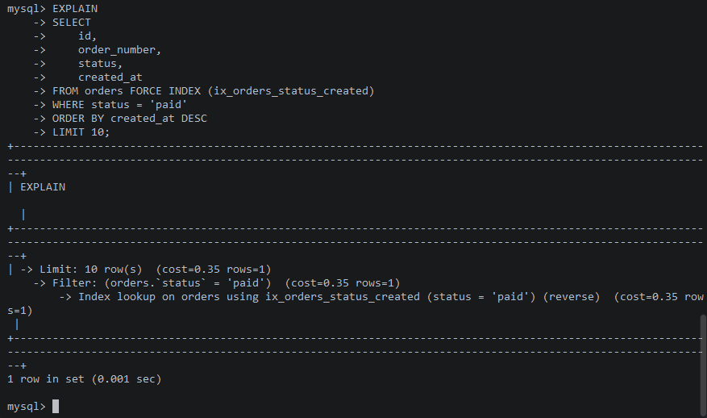

**Результат выборки**

```sql
SELECT
    id,
    order_number,
    status,
    created_at
FROM orders
WHERE status = 'paid'
ORDER BY created_at DESC
LIMIT 10;
```

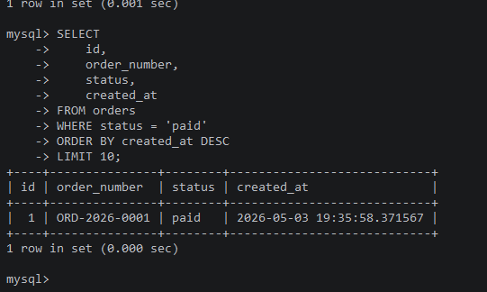

**Вывод**

Индекс `(status, created_at)` подходит под условие `status = ...` и сортировку по `created_at`. MySQL получает нужный статус из индекса и читает строки в порядке даты, без лишнего прохода по заказам.

## 4. Полнотекстовый индекс по товарам

**Зачем индекс**

Нужен поиск по названию товара, описанию и свойствам из JSON. В MySQL `FULLTEXT` не строится прямо по JSON, поэтому свойства вынесены в generated column `search_properties`.

`search_properties` собирает важные поля из `attributes`: цвет, материал, список features, гарантию, длительность доступа. После этого `FULLTEXT` строится по трём текстовым источникам: `title`, `description`, `search_properties`.

**Запрос без полнотекстового индекса**

```sql
EXPLAIN
SELECT
    id,
    sku,
    title
FROM products
WHERE title LIKE '%mechanical%'
   OR description LIKE '%mechanical%'
   OR JSON_SEARCH(attributes, 'one', 'mechanical') IS NOT NULL;
```

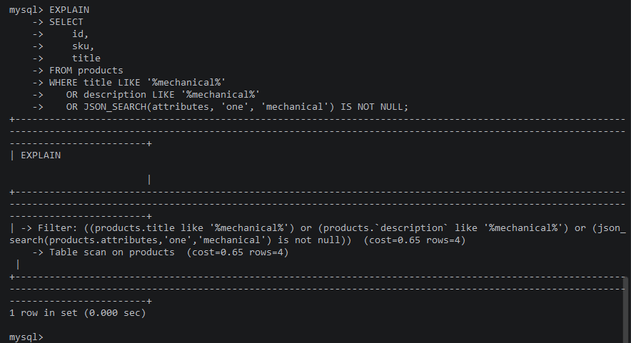

**Запрос с полнотекстовым индексом**

```sql
EXPLAIN
SELECT
    id,
    sku,
    title,
    MATCH(title, description, search_properties)
        AGAINST('mechanical backlight' IN NATURAL LANGUAGE MODE) AS score
FROM products
WHERE MATCH(title, description, search_properties)
    AGAINST('mechanical backlight' IN NATURAL LANGUAGE MODE);
```

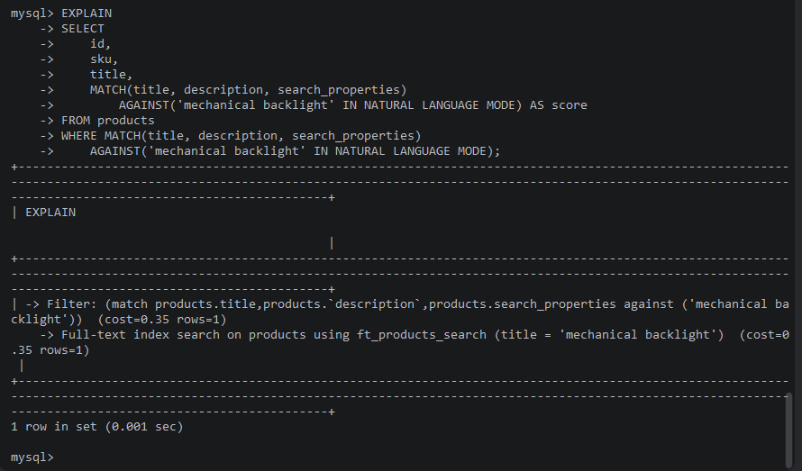

**Результат выборки**

```sql
SELECT
    id,
    sku,
    title,
    MATCH(title, description, search_properties)
        AGAINST('mechanical backlight' IN NATURAL LANGUAGE MODE) AS score
FROM products
WHERE MATCH(title, description, search_properties)
    AGAINST('mechanical backlight' IN NATURAL LANGUAGE MODE);
```

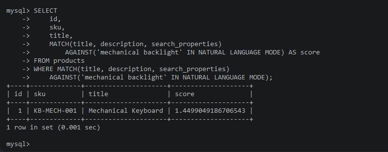

**Вывод**

Вариант с `LIKE '%...%'` и `JSON_SEARCH` плохо масштабируется: MySQL не может эффективно использовать обычный BTREE-индекс для поиска по середине строки. `FULLTEXT` решает именно эту задачу: текст заранее разбивается на токены, а поиск идёт по полнотекстовому индексу.

## Общий вывод

Индексы добавлены под реальные запросы, а не просто для количества. `uq_products_price` помогает курсорной пагинации, `ix_products_category_price` закрывает фильтр каталога, `ix_orders_status_created` ускоряет рабочий список заказов, а `ft_products_search` даёт нормальный поиск по товарам и JSON-свойствам.
