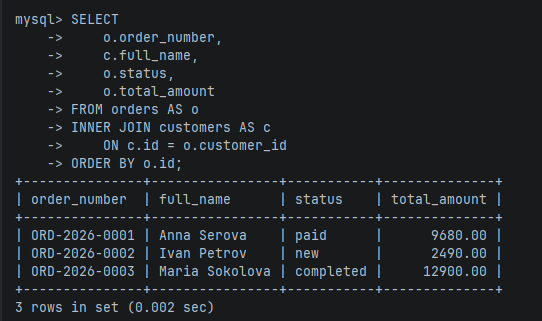
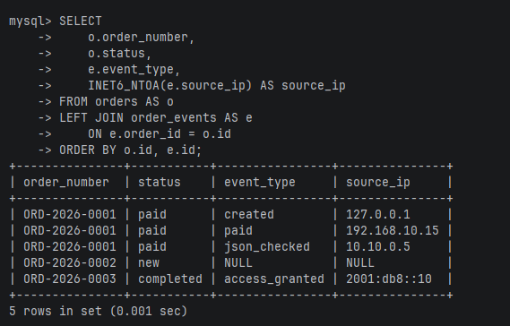
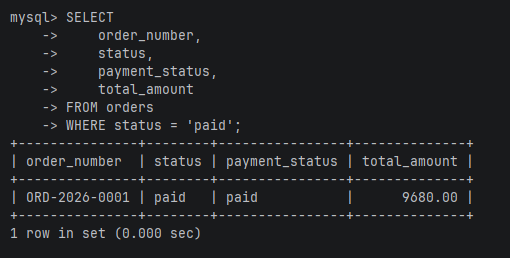
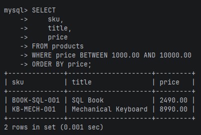
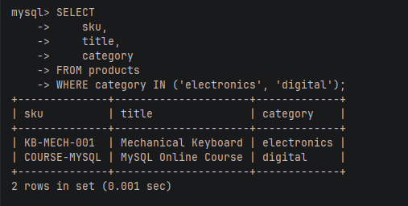
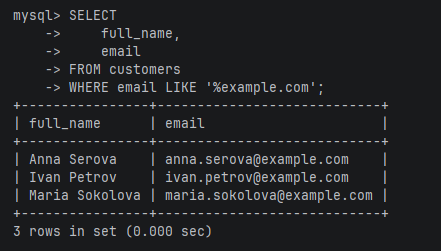
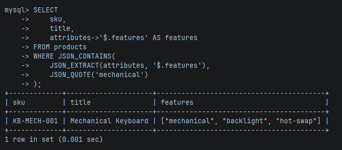

# JOIN и WHERE

## INNER JOIN

запрос

```sql
SELECT
    o.order_number,
    c.full_name,
    o.status,
    o.total_amount
FROM orders AS o
INNER JOIN customers AS c
    ON c.id = o.customer_id
ORDER BY o.id;
```

зачем запрос

Показать заказы вместе с покупателями. Такая выборка нужна для страницы заказов в админке: номер заказа сам по себе мало что говорит, а имя покупателя сразу даёт контекст.

результат



## LEFT JOIN

запрос

```sql
SELECT
    o.order_number,
    o.status,
    e.event_type,
    INET6_NTOA(e.source_ip) AS source_ip
FROM orders AS o
LEFT JOIN order_events AS e
    ON e.order_id = o.id
ORDER BY o.id, e.id;
```

зачем запрос

Показать все заказы и связанные с ними события. Если у заказа ещё нет событий, он всё равно попадёт в результат. Так проще найти заказы без технической истории.

результат



## WHERE: равно

запрос

```sql
SELECT
    order_number,
    status,
    payment_status,
    total_amount
FROM orders
WHERE status = 'paid';
```

зачем запрос

Найти оплаченные заказы. Такая выборка нужна перед упаковкой или передачей заказа в доставку.

результат



## WHERE: диапазон

запрос

```sql
SELECT
    sku,
    title,
    price
FROM products
WHERE price BETWEEN 1000.00 AND 10000.00
ORDER BY price;
```

зачем запрос

Отобрать товары в заданном ценовом диапазоне. Это обычный фильтр каталога: покупатель задаёт бюджет и видит подходящие позиции.

результат



## WHERE: IN

запрос

```sql
SELECT
    sku,
    title,
    category
FROM products
WHERE category IN ('electronics', 'digital');
```

зачем запрос

Показать товары из нескольких категорий сразу. Такая выборка пригодится для витрины техники и цифровых продуктов.

результат



## WHERE: LIKE

запрос

```sql
SELECT
    full_name,
    email
FROM customers
WHERE email LIKE '%example.com';
```

зачем запрос

Найти покупателей с почтой на конкретном домене. В проекте это может пригодиться для проверки тестовых аккаунтов или анализа корпоративных клиентов.

результат



## WHERE: JSON_CONTAINS

запрос

```sql
SELECT
    sku,
    title,
    attributes->'$.features' AS features
FROM products
WHERE JSON_CONTAINS(
    JSON_EXTRACT(attributes, '$.features'),
    JSON_QUOTE('mechanical')
);
```

зачем запрос

Найти товары с конкретной характеристикой внутри JSON. Это полезно, когда характеристики у разных категорий отличаются, но по части из них всё равно нужен поиск.

результат


