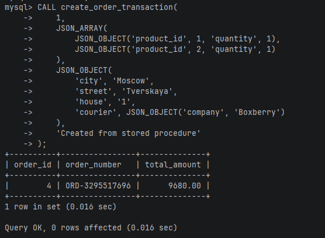
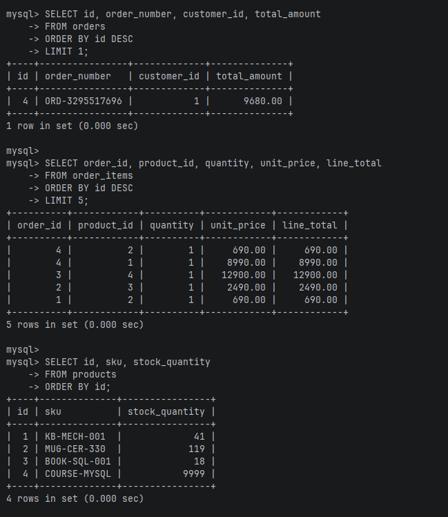
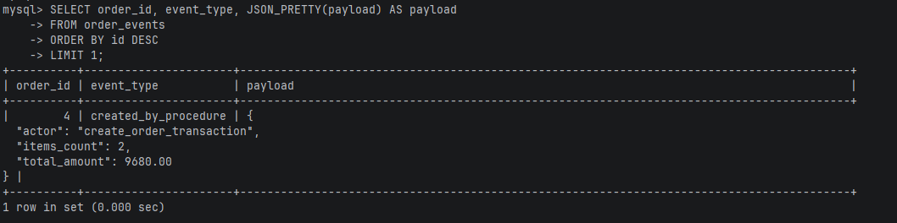
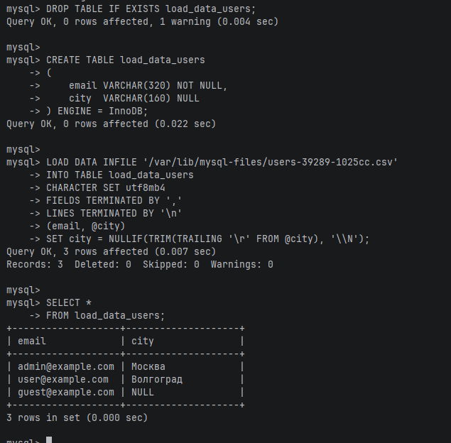
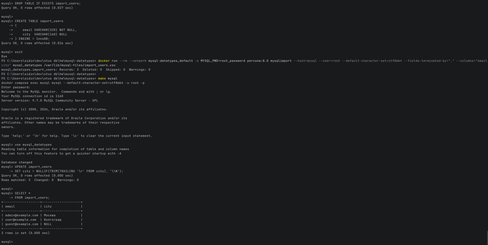

# Транзакции и загрузка CSV

## 1. Транзакция в хранимой процедуре

**Задание**

Оформить заказ одной операцией: создать заказ, добавить строки заказа, уменьшить остатки товаров, начислить бонусы покупателю и записать событие в журнал.

**Текст**

```sql
DELIMITER //

DROP PROCEDURE IF EXISTS create_order_transaction//

CREATE PROCEDURE create_order_transaction(
    IN p_customer_id BIGINT UNSIGNED,
    IN p_items JSON,
    IN p_delivery_details JSON,
    IN p_customer_comment VARCHAR(500)
)
BEGIN
    DECLARE v_order_id BIGINT UNSIGNED;
    DECLARE v_order_number CHAR(14);
    DECLARE v_total_amount DECIMAL(12, 2) DEFAULT 0.00;
    DECLARE v_customer_exists INT DEFAULT 0;
    DECLARE v_missing_products INT DEFAULT 0;
    DECLARE v_not_enough_stock INT DEFAULT 0;
    DECLARE v_updated_products INT DEFAULT 0;
    DECLARE v_items_count INT DEFAULT 0;

    DECLARE EXIT HANDLER FOR SQLEXCEPTION
    BEGIN
        ROLLBACK;
        DROP TEMPORARY TABLE IF EXISTS tmp_order_items;
        RESIGNAL;
    END;

    IF p_items IS NULL OR JSON_TYPE(p_items) <> 'ARRAY' THEN
        SIGNAL SQLSTATE '45000'
            SET MESSAGE_TEXT = 'Order items must be a JSON array';
    END IF;

    DROP TEMPORARY TABLE IF EXISTS tmp_order_items;

    CREATE TEMPORARY TABLE tmp_order_items
    (
        product_id BIGINT UNSIGNED NOT NULL PRIMARY KEY,
        quantity   SMALLINT UNSIGNED NOT NULL
    ) ENGINE = MEMORY;

    INSERT INTO tmp_order_items (product_id, quantity)
    SELECT
        item.product_id,
        SUM(item.quantity) AS quantity
    FROM JSON_TABLE(
        p_items,
        '$[*]'
        COLUMNS (
            product_id BIGINT UNSIGNED PATH '$.product_id',
            quantity   SMALLINT UNSIGNED PATH '$.quantity'
        )
    ) AS item
    WHERE item.product_id IS NOT NULL
      AND item.quantity > 0
    GROUP BY item.product_id;

    SELECT COUNT(*)
    INTO v_items_count
    FROM tmp_order_items;

    IF v_items_count = 0 THEN
        SIGNAL SQLSTATE '45000'
            SET MESSAGE_TEXT = 'Order items are empty';
    END IF;

    SET TRANSACTION ISOLATION LEVEL READ COMMITTED;
    START TRANSACTION;

    SELECT COUNT(*)
    INTO v_customer_exists
    FROM customers
    WHERE id = p_customer_id
      AND is_active = TRUE;

    IF v_customer_exists = 0 THEN
        SIGNAL SQLSTATE '45000'
            SET MESSAGE_TEXT = 'Customer was not found or inactive';
    END IF;

    SELECT COUNT(*)
    INTO v_missing_products
    FROM tmp_order_items AS item
    LEFT JOIN products AS p
        ON p.id = item.product_id
    WHERE p.id IS NULL;

    IF v_missing_products > 0 THEN
        SIGNAL SQLSTATE '45000'
            SET MESSAGE_TEXT = 'Some products were not found';
    END IF;

    SELECT
        p.id,
        p.stock_quantity,
        item.quantity
    FROM products AS p
    INNER JOIN tmp_order_items AS item
        ON item.product_id = p.id
    FOR UPDATE;

    SELECT COUNT(*)
    INTO v_not_enough_stock
    FROM products AS p
    INNER JOIN tmp_order_items AS item
        ON item.product_id = p.id
    WHERE p.stock_quantity < item.quantity;

    IF v_not_enough_stock > 0 THEN
        SIGNAL SQLSTATE '45000'
            SET MESSAGE_TEXT = 'Not enough products in stock';
    END IF;

    SET v_order_number = CONCAT('ORD-', RIGHT(UUID_SHORT(), 10));

    INSERT INTO orders
        (order_number, customer_id, status, payment_status, total_amount, delivery_details, customer_comment)
    VALUES
        (v_order_number, p_customer_id, 'new', 'waiting', 0.00, p_delivery_details, p_customer_comment);

    SET v_order_id = LAST_INSERT_ID();

    INSERT INTO order_items
        (order_id, product_id, quantity, unit_price, discount_percent)
    SELECT
        v_order_id,
        p.id,
        item.quantity,
        p.price,
        0.00
    FROM tmp_order_items AS item
    INNER JOIN products AS p
        ON p.id = item.product_id;

    UPDATE products AS p
    INNER JOIN tmp_order_items AS item
        ON item.product_id = p.id
    SET p.stock_quantity = p.stock_quantity - item.quantity
    WHERE p.stock_quantity >= item.quantity;

    SET v_updated_products = ROW_COUNT();

    IF v_updated_products <> v_items_count THEN
        SIGNAL SQLSTATE '45000'
            SET MESSAGE_TEXT = 'Not enough products in stock';
    END IF;

    SELECT SUM(line_total)
    INTO v_total_amount
    FROM order_items
    WHERE order_id = v_order_id;

    UPDATE orders
    SET total_amount = v_total_amount
    WHERE id = v_order_id;

    UPDATE customers
    SET loyalty_points = loyalty_points + FLOOR(v_total_amount / 100)
    WHERE id = p_customer_id;

    INSERT INTO order_events
        (order_id, event_type, source_ip, payload)
    VALUES
        (
            v_order_id,
            'created_by_procedure',
            INET6_ATON('127.0.0.1'),
            JSON_OBJECT(
                'actor', 'create_order_transaction',
                'items_count', v_items_count,
                'total_amount', v_total_amount
            )
        );

    COMMIT;

    DROP TEMPORARY TABLE IF EXISTS tmp_order_items;

    SELECT
        v_order_id AS order_id,
        v_order_number AS order_number,
        v_total_amount AS total_amount;
END//

DELIMITER ;
```

Пример вызова:

```sql
CALL create_order_transaction(
    1,
    JSON_ARRAY(
        JSON_OBJECT('product_id', 1, 'quantity', 1),
        JSON_OBJECT('product_id', 2, 'quantity', 1)
    ),
    JSON_OBJECT(
        'city', 'Moscow',
        'street', 'Tverskaya',
        'house', '1',
        'courier', JSON_OBJECT('company', 'Boxberry')
    ),
    'Created from stored procedure'
);
```

Проверка:

```sql
SELECT id, order_number, customer_id, total_amount
FROM orders
ORDER BY id DESC
LIMIT 1;

SELECT order_id, product_id, quantity, unit_price, line_total
FROM order_items
ORDER BY id DESC
LIMIT 5;

SELECT id, sku, stock_quantity
FROM products
ORDER BY id;

SELECT order_id, event_type, JSON_PRETTY(payload) AS payload
FROM order_events
ORDER BY id DESC
LIMIT 1;
```

**Зачем**

Оформление заказа нельзя разбивать на независимые операции. Если заказ уже создан, но остатки не списались или событие не попало в журнал, база становится противоречивой. Поэтому используется транзакция: при ошибке всё откатывается через `ROLLBACK`, а при успехе фиксируется через `COMMIT`.

`SELECT ... FOR UPDATE` явно блокирует строки товаров, которые участвуют в заказе. Пока транзакция не завершится, параллельный заказ не сможет изменить эти же строки и списать тот же остаток. Это важно именно для склада: проверка количества и списание должны относиться к одному и тому же состоянию данных.

Проверка `p.stock_quantity < item.quantity` выполняется после блокировки. Если товара не хватает, процедура вызывает `SIGNAL`, обработчик делает `ROLLBACK`, а временная таблица удаляется.

`UPDATE products ... WHERE stock_quantity >= quantity` всё равно оставлен. Это последняя защита на уровне самой операции списания: даже если логика выше когда-нибудь изменится, товар не уйдёт в отрицательный остаток.

Уровень изоляции `READ COMMITTED` выбран как практичный вариант для такого сценария. Нам не нужно удерживать снимок всей базы до конца транзакции, но нужны актуальные строки товаров и их блокировка перед списанием.

**Результат**

Вызов процедуры



Проверка изменений





## 2. Загрузка CSV через LOAD DATA

**Задание**

Загрузить файл `data/csv/users-39289-1025cc.csv` в отдельную таблицу `load_data_users`.

**Текст**

Файл нужно положить в каталог, доступный MySQL внутри контейнера:

```bash
docker compose cp data/csv/users-39289-1025cc.csv mysql:/var/lib/mysql-files/users-39289-1025cc.csv
```

SQL для загрузки:

```sql
DROP TABLE IF EXISTS load_data_users;

CREATE TABLE load_data_users
(
    email VARCHAR(320) NOT NULL,
    city  VARCHAR(160) NULL
) ENGINE = InnoDB;

LOAD DATA INFILE '/var/lib/mysql-files/users-39289-1025cc.csv'
INTO TABLE load_data_users
CHARACTER SET utf8mb4
FIELDS TERMINATED BY ','
LINES TERMINATED BY '\n'
(email, @city)
SET city = NULLIF(TRIM(TRAILING '\r' FROM @city), '\\N');

SELECT *
FROM load_data_users;
```

**Зачем**

`LOAD DATA` быстро загружает CSV на стороне сервера MySQL. Таблица отдельная: файл из материалов не обязан совпадать со схемой интернет-магазина, поэтому здесь проверяется именно механизм импорта.

`NULLIF(..., '\\N')` превращает значение `\N` из CSV в настоящий `NULL`.

**Результат**



## 3. Загрузка CSV через mysqlimport

**Задание**

Загрузить тот же CSV через `mysqlimport` в отдельную таблицу `import_users`.

**Текст**

`mysqlimport` выбирает таблицу по имени файла, поэтому файл копируется под имя `import_users.csv`:

```bash
docker compose cp data/csv/users-39289-1025cc.csv mysql:/var/lib/mysql-files/import_users.csv
```

Таблица:

```sql
DROP TABLE IF EXISTS import_users;

CREATE TABLE import_users
(
    email VARCHAR(320) NOT NULL,
    city  VARCHAR(160) NULL
) ENGINE = InnoDB;
```

Импорт запускается из отдельного клиентского контейнера. В образе `mysql:9.7.0` утилиты `mysqlimport` нет, а в `percona:8.0` она есть:

```powershell
docker run --rm --network mysql-datatypes_default -e MYSQL_PWD=root_password percona:8.0 mysqlimport --host=mysql --user=root --default-character-set=utf8mb4 --fields-terminated-by="," --columns="email,city" mysql_datatypes /var/lib/mysql-files/import_users.csv
```

Проверка:

```sql
UPDATE import_users
SET city = NULLIF(TRIM(TRAILING '\r' FROM city), '\\N');

SELECT *
FROM import_users;
```

**Зачем**

`mysqlimport` делает ту же работу, что и `LOAD DATA`, но запускается как отдельная консольная утилита. Это удобно для скриптов и разовых загрузок из командной строки.

Здесь `mysqlimport` запускается не внутри MySQL-сервера, а из отдельного контейнера в той же Docker-сети `mysql-datatypes_default`. К серверу он подключается по имени сервиса `mysql`, а сам CSV уже лежит в контейнере MySQL по пути `/var/lib/mysql-files/import_users.csv`.

**Результат**


